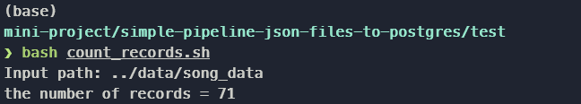

# Simple Pipeline JSON files to PostgreSQL
The purpose of the project is to learn how to get data from json files and load into Postgres Database.

## How to do this
Note: To do this you need to have postgres and pgAdmin on your machine.

**Step 1:** Explore data folder structure 
```
cd data
```
```
tree
.
├── log_data
│   └── 2018
│       └── 11
│           ├── 2018-11-01-events.json
│           ├── 2018-11-02-events.json
│           ├── 2018-11-03-events.json
│           ├──           .
│           ├──           .
│           ├──           .
│           ├── 2018-11-29-events.json
│           └── 2018-11-30-events.json
└── song_data
    └── A
        ├── A
        │   ├── A
        │   │   ├── TRAAAAW128F429D538.json
        │   │   ├── TRAAABD128F429CF47.json
        │   │   ├── TRAAADZ128F9348C2E.json
        │   │   ├──           .
        │   │   ├──           .
        │   │   ├──           .
        │   │   ├── TRAAAVG12903CFA543.json
        │   │   └── TRAAAVO128F93133D4.json
        │   ├── B
        │   │   ├── TRAABCL128F4286650.json
        │   │   ├── TRAABDL12903CAABBA.json
        │   │   ├── TRAABJL12903CDCF1A.json
        │   │   ├──           .
        │   │   ├──           .
        │   │   ├──           .
        │   │   ├── TRAABYN12903CFD305.json
        │   │   └── TRAABYW128F4244559.json
        │   └── C
        │       ├── TRAACCG128F92E8A55.json
        │       ├── TRAACER128F4290F96.json
        │       ├── TRAACFV128F935E50B.json
        │       ├──           .
        │       ├──           .
        │       ├──           .
        │       ├── TRAACVS128E078BE39.json
        │       └── TRAACZK128F4243829.json
        └── B
            ├── A
            │   ├── TRABACN128F425B784.json
            │   ├── TRABAFJ128F42AF24E.json
            │   ├── TRABAFP128F931E9A1.json
            │   ├──           .
            │   ├──           .
            │   ├──           .
            │   ├── TRABAXV128F92F6AE3.json
            │   └── TRABAZH128F930419A.json
            ├── B
            │   ├── TRABBAM128F429D223.json
            │   ├── TRABBBV128F42967D7.json
            │   ├── TRABBJE12903CDB442.json
            │   ├──           .
            │   ├──           .
            │   ├──           .
            │   ├── TRABBXU128F92FEF48.json
            │   └── TRABBZN12903CD9297.json
            └── C
                ├── TRABCAJ12903CDFCC2.json
                ├── TRABCEC128F426456E.json
                ├── TRABCEI128F424C983.json
                ├──           .
                ├──           .
                ├──           .
                ├── TRABCXB128F4286BD3.json
                └── TRABCYE128F934CE1D.json
```
**Step 2:** Explore how many records do we have using shell script (In test/)  
```
bash count_records.sh
```
Ex.
  

<u>Tip!</u> If you can't run the script you need to install fdfind utility on your machine.
```
sudo apt install fd-find -y
```

**Step 3:** Create Schema using pgAdmin  

  

**Step 3:** Login
```
psql -h 127.0.0.1 -d postgres -U postgres
```
or
```
psql -U postgres
```
**Step 4:** Create database then connect
```sql
CREATE DATABASE sparkify;
```
```
\c sparkify
```
**Step 5:** Create tables  
```
\i create_tables.sql
```
<u>Tip!</u> Run this command in the directory that contains the script.  

**Step 6:** Run etl
```
python etl.py
```

All DONE!!!